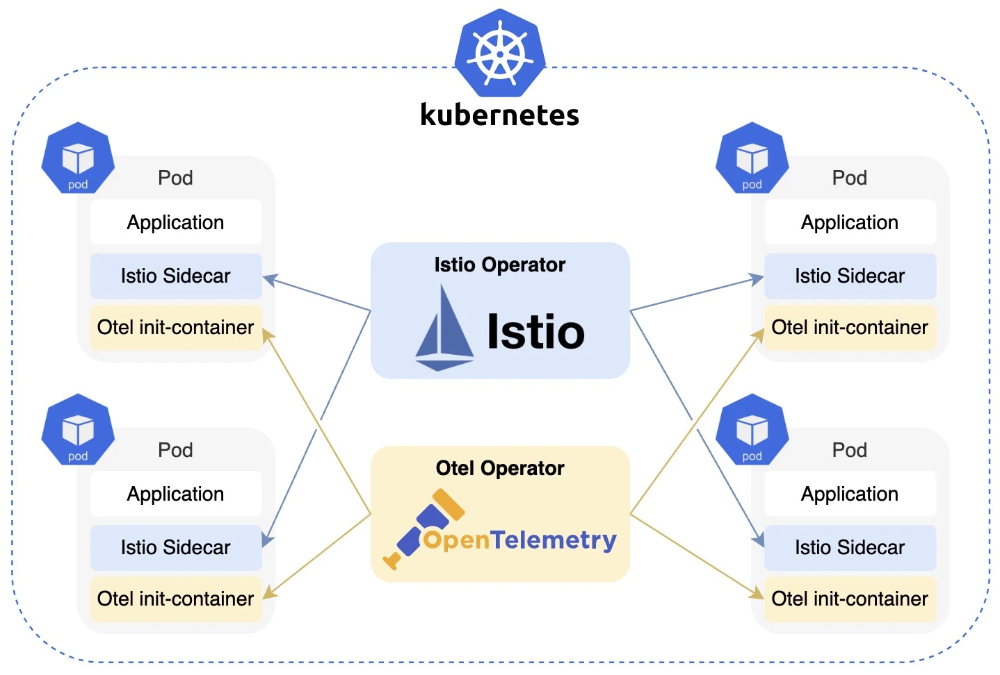

# swimlane-k8s-istio-otel-demo

Swimlane demo using Kubernetes, Istio, and OpenTelemetry, including request routing, fallback, and request header propagation.

## Introduction

**Swimlane** enables traffic routing between services. When a service has a swimlane deployed, traffic can be routed to that swimlane; otherwise, it falls back to the `main` service.

In this demo, we introduce swimlane for microservices architecture using Kubernetes, service mesh (Istio), and OpenTelemetry.

<p align="center" width="600">
  
  <br/>
  <b>Swimlane Overview</b>
</p>

The above figure illustrates the swimlane concept. Request without swimlane (R1) goes through the main swimlane. Request with swimlane (R2) routes to services in the same swimlane (service A and C); otherwise, falls back to the main swimlane (service B).

Swimlane can be applied to the following scenarios:

### 1. Independent Dev Environments

To develop multiple features at the same time, we might face a scenario that both `featureA` and `featureB` want to do an end-to-end test in `dev` environment. Usually, we have no choice but to do the testing in a serialized manner. With the help of swimlanes, we can deploy features on different swimlanes to isolate environments and do the testing in parallel.

<p align="center" width="600">
  
  <br/>
  <b>Independent dev environments</b>
</p>

### 2. Fine-grained Traffic Control

Sometimes we need to route requests to different versioned services based on certain logic, such as canary deployment, or A/B testing. For example, requests from `user1` always route to `v1` services, and requests from `user2` always route to `v2` services.

To make fine-grained control over traffic, we can have an algorithm at Gateway to accurately control what swimlane a request should go. For example, when a request comes to Gateway with `userId`, we can have an algorithm like users with odd id go to swimlane `v1`, users with even id go to swimlane `v2`, and so on. We can even have a whitelist to filter traffic.

<p align="center">
  
  <br/>
  <b>Fine-grained Traffic Control</b>
</p>

## Architecture

We want to implement the swimlane feature transparent to microservices so that each service can focus on its application logic without coupling swimlane logic. Therefore, we need the following abilities in our microservices.

### 1. Service Discovery

In a microservices architecture, services, especially stateless services, are disposable and go up and down easily. We hope upstream services know where to visit downstream services all the time. We cannot rely on IP addresses otherwise we need to configure our services frequently.

As a result, we introduce [Kubernetes](https://kubernetes.io/), a container orchestration product, to manage our services, which natively supports service discovery via `Service` resource and etcd, as well as its labels and selectors.

### 2. Traffic Routing Between Services

As we deploy services in tags (e.g. `v1` or `v2`), we need to know how to route traffic to services with different tags. For example, requests with `x-swimlane: v1` go to `v1` services, and requests with `x-swimlane: v2` go to `v2` services, and so on. Moreover, one key feature in swimlane is fallback: if a service doesn't have a swimlane deployed, the request falls back to `main` service.

Kubernetes has its limitations in traffic routing. `Service` simply exposes the network to Pods. `Ingress` only works as a gateway and route traffic in the very beginning, not for communications between downstream services.
Therefore, we need a mechanism to control the inbound and outbound traffic of each service so that we can control routing in a more fine-grained manner. This is exactly what Service Mesh is doing. We use [Istio](https://istio.io/latest/) to take over the traffic between services by injecting a sidecar (proxy) to each service, which is managed by a control plane.

<p align="center">
  
  <br/>
  <b>Istio Architecture.</b> <i>source: <a href="https://istio.io/latest/docs/ops/deployment/architecture/">Istio.io</a></i>
</p>

### 3. Swimlane Propagation

Swimlane is a piece of info in a request, such as `x-swimlane: v1`, which needs to be propagated to all downstream services so that for each outbound traffic, service mesh (Istio) knows what services to look for, and it only falls back to `main` services if that a service doesn't have a deploy on that swimlane.
We can propagate swimlane through request `headers`. Unfortunately, Istio doesn't support header propagation: [Why can't Istio propagate headers instead of the application](https://istio.io/v1.20/faq/distributed-tracing/#istio-copy-headers).

The good news is, we don't need to maintain header-propagation logic in our applications either. [OpenTelemetry](https://opentelemetry.io/) is a project helps people enable effective observability. We can use its auto-instrumentation to propagate request `headers` without intruding application code.
Furthermore, we have [OpenTelemetry Operator for Kubernetes](https://github.com/open-telemetry/opentelemetry-operator) to run Custom Resource Definitions (CRD) on K8s, which further provides a layer of transparency; otherwise, we need to inject auto-instrument manually in Dockerfile of each application image.

However, auto-instrument doesn't support all programming languages. Languages without auto-instrument do need to maintain some code in applications. Check out [Injecting Auto-instrumentation](https://opentelemetry.io/docs/kubernetes/operator/automatic/) for further information.

---

The following figure summarizes the tech architecture in this demo. We use

1. **Kubernetes** to manage resources and do the service discovery;
2. **Istio** for service mesh to take over traffic and do the traffic routing with fallback, which is powered by an `Envoy proxy` (sidecar);
3. **OpenTelemetry** for request headers propagation by auto-instrument, which works as an `init-container` when starting a pod.

<p align="center">
  
  <br/>
  <b>Demo Tech Architecture</b>
</p>

| Product                | Version | Desciption                                                                     |
| ---------------------- | ------- | ------------------------------------------------------------------------------ |
| Kubernetes             | 1.27.4  | Resource management and service discovery                                      |
| Istio                  | 1.20.1  | Service mesh taking over traffic in services                                   |
| OpenTelemetry Operator | 0.90    | Telemetry for header propagation                                               |
| cert-manager           | 1.13.3  | Dependency of OpenTelemetry Operator for pod-to-pod communication certificates |

## How to Run Demo

### Requirement

- Docker
- Kubernetes (we use [minikube](https://minikube.sigs.k8s.io/docs/start/) here)
- Istio
  ```bash
  # Install istioctl for MacOS users using `brew`
  brew install istioctl
  istioctl install --set profile=demo -y
  kubectl label namespace default istio-injection=enabled
  ```

### Deploy Resources

```bash
# 1. Start Docker: make sure Docker client is running
# 2. Start K8s environment
minikube start
# 3. Install dependencies (Istio/OpenTelemetry CRD)
make install
# 4. Deploy resources on K8s
# Need to wait for about 2 minutes for resources be ready
make deploy
```

The resources are ready when you see the following message, and you can send requests to the endpoint.

```
Forwarding from 127.0.0.1:8080 -> 8080
Forwarding from [::1]:8080 -> 8080
```

### Demo Architecture

In this demo, we have a chain of microservices: Gateway, GoodsService, and PricingService.

- **Gateway**: Go service, worked as a gateway to dispatch requests.
- **GoodsService**: Python service, deployed on `main`, `dev-feature1` and `dev-feature2` swimlanes.
- **PricingService**: Java service, deployed on `main` and `dev-feature1` swimlanes.

<p align="center">
  
  <br/>
  <b>Demo Architecture</b>
</p>

### Result

#### Case 1: No swimlane / `x-swimlane: main`

- visit all `main` services

```bash
curl "http://127.0.0.1:8080/goods"
curl "http://127.0.0.1:8080/goods" -H 'x-swimlane: main'
```

<p align="center">
  
</p>

#### Case 2: `x-swimlane: dev-feature1`

- visit all `dev-feature1` services

```bash
curl "http://127.0.0.1:8080/goods" -H 'x-swimlane: dev-feature1'
```

<p align="center">
  
</p>

#### Case 3: `x-swimlane: dev-feature2`

- visit `dev-feature2` services, falls back to `main` if no corresponding swimlane in that service

```bash
curl "http://127.0.0.1:8080/goods" -H 'x-swimlane: dev-feature2'
```

<p align="center">
  
</p>

#### Case 4: `x-swimlane: not_exist`

- falls back to `main` since no service deployed in this swimlane

```bash
curl "http://127.0.0.1:8080/goods" -H 'x-swimlane: not_exist'
```

<p align="center">
  
</p>

### Delete Resources

```bash
# 1.Delete resources on K8s
make undeploy
# 2.Uninstall CRD
make uninstall
# 3.Stop K8s
minikube stop
```

## Appendix

### Kubernetes Gateway API

Kubernetes [Gateway API](https://gateway-api.sigs.k8s.io/) will become the default API for traffic management in Istio [in the future](https://istio.io/latest/blog/2022/gateway-api-beta/). However, at the time this demo is done, configuration for internal mesh (east-west) traffic is an [experimental feature](https://gateway-api.sigs.k8s.io/geps/overview/#status) of the Gateway API.
This project implemented Istio [Request Routing](https://istio.io/latest/docs/tasks/traffic-management/request-routing/) in both Gateway API and Istio API. The `master` branch uses Gateway API, while [istio-api](https://github.com/blue86321/swimlane-k8s-istio-otel-demo/tree/istio-api) branch uses Istio API. You can go and check it out if you are interested in it.
